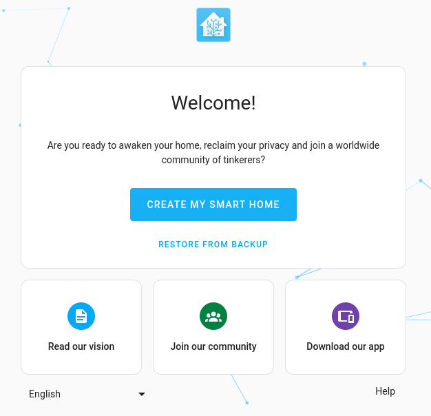

# homeassistant-core

> [`CONTAINERS`](#user-content-containers) [`IMAGES`](#user-content-images) [`RUN`](#user-content-run) [`BUILD`](#user-content-build)

> [!NOTE]
> Thank you to [**@ms1design**](https://github.com/ms1design) for his generous contributions and work on porting Home Assistant & Wyoming containers for Jetson!

<p align="center"></p>

The container image is based on the `Home Assistant Core` with a few modifications:

| | `HA OS` | `Container` | `Core` | [`Core` on `Jetson`](/packages/smart-home/homeassistant-core/) | `Supervised` |
|-|:-:|:-:|:-:|:-:|:-:|
| Automations | ✅ | ✅ | ✅ | ✅ | ✅ |
| Dashboards | ✅ | ✅ | ✅ | ✅ | ✅ |
| Integrations | ✅ | ✅ | ✅ | ✅ | ✅ |
| Blueprints | ✅ | ✅ | ✅ | ✅ | ✅ |
| **Uses container** | ✅ | ✅ | ❌ | ✅[^1] | ✅ |
| Supervisor | ✅ | ❌ | ❌ | ❌ | ✅ |
| **Add-ons** | ✅ | ❌ | ❌ | ✅[^2] | ✅ |
| Backups | ✅ | ✅ | ✅ | ✅ | ✅ |
| Managed Restore | ✅ | ❌ | ❌ |  ❌ | ✅ |
| Managed OS | ✅ | ❌ | ❌ |  ❌ | ❌ |

[^1]: **Home Assistant Core** is now containerized.
[^2]: Supports only manually installed, dockerized and preconfigured [`wyoming` **Local Voice Assistant add-ons**](/packages/smart-home/wyoming/) from this repository. These add-ons are compatible with `Home Assistant Core` hosted on any machine.

## `docker-compose` example

If you want to use `docker compose` to run [Home Assistant Core](/packages/smart-home/homeassistant-core/) [Voice Assistant Pipeline](https://www.home-assistant.io/voice_control/) on a **Jetson** device with `cuda` enabled, you can find a full example [`docker-compose.yaml` here](/packages/smart-home/wyoming/docker-compose.yaml).

```yaml
name: home-assistant-jetson
version: "3.9"
services:
  homeassistant:
    image: dustynv/homeassistant-core:latest-r36.2.0
    restart: unless-stopped
    init: false
    privileged: true
    network_mode: host
    container_name: homeassistant
    hostname: homeassistant
    ports:
      - "8123:8123"
    volumes:
      - ha-config:/config
      - /etc/localtime:/etc/localtime:ro
      - /etc/timezone:/etc/timezone:ro

volumes:
  ha-config:
```

## Onboarding

The user interface can be found at http://your-ip:8123. *(replace with the `hostname` or `IP` of the system)*. Follow the wizard to set up Home Assistant. Feel free to follow the [official instructions](https://www.home-assistant.io/getting-started/onboarding/).

## How to's

We encourage to look for help in the [official Home Assistant documentation](https://www.home-assistant.io/docs/) and within the [HA Community Forums](https://community.home-assistant.io/) or on a [Jetson Research Group](https://www.jetson-ai-lab.com/research.html) [thread on the NVIDIA forum](https://forums.developer.nvidia.com/t/jetson-ai-lab-home-assistant-integration/288225).

<details>
<summary><b>Configuration files location</b></summary>
<hr>

You can specify where you want to store your Home Assistant Core configuration by attaching a docker `volume`. Make sure that you keep the `:/config` part:

```sh
-v /PATH_TO_YOUR_CONFIG:/config
```
<hr>
<br>
</details>

<details>
<summary><b>Devices auto-discovery</b></summary>
<hr>

Home Assistant can discover and automatically configure `zeroconf`/`mDNS` and `UPnP` devices and add-ons on your network. In order for this to work you must create the container with `--net=host`:

when using `docker cli`:
```sh
--net=host
```

when using `docker-compose.yaml`:
```yaml
network_mode: host
```
<hr>
<br>
</details>

<details>
<summary><b>Add-on auto-discovery</b></summary>
<hr>

> **TLDR;** *It's disabled, go with manual way...*

Native auto-discovery of add-ons running on the same host/network is disabled due to the requirement of running [`Home Assistant Supervisor`](https://www.home-assistant.io/integrations/hassio/). This has some deep debian system dependencies which were too tedious to port in this project.

> Most Home Assistant add-ons use [`bashio`](https://github.com/hassio-addons/bashio) under the hood so some of the system overlay commands ware adapted to make them work without `Supervisor`.

#### Manual `wyoming` add-on discovery

To manually add the `wyoming` enabled add-on from this repository to the running Home Assistant Core instance, just follow the steps below:

1. Browse to your **Home Assistant** instance (eg.: `homeassistant.local:8123`).
2. Go to `Settings > Devices & Services`.
3. In the bottom right corner, select the `Add Integration` button.
4. From the list, search & select `Wyoming Protocol`.
5. Enter the `wyoming` add-on `Host IP` address (use `localhost` if running of the same host as Home Assistant).
6. Enter the `wyoming` add-on `port` (default is `10400`).
<hr>
<br>
</details>

<details>
<summary><b>Accessing Bluetooth Devices</b></summary>
<hr>

To provide **Home Assistant** with access to the host's `Bluetooth` device(s), the Home Assistant Core container uses `BlueZ` on the `host` - add the capabilities `NET_ADMIN` and `NET_RAW` to the container, and map `dbus` as a `volume` as shown in the examples below to enable Bluetooth support:

when using `docker cli`:
```sh
--cap-add=NET_ADMIN \
--cap-add=NET_RAW \
-v /var/run/dbus:/var/run/dbus:ro
```
when using `docker-compose.yaml`:
```yaml
cap_add:
  - NET_ADMIN
  - NET_RAW
volumes:
  - /var/run/dbus:/var/run/dbus:ro
```
<hr>
<br>
</details>

## TODO's

- [ ] Fix add-ons auto-discovery

## Support

Got questions? You have several options to get them answered:

#### For general **Home Assistant** Support:
- The [Home Assistant Discord Chat Server](https://discord.gg/c5DvZ4e).
- The Home Assistant [Community Forum](https://community.home-assistant.io/).
- Join the [Reddit subreddit](https://reddit.com/r/homeassistant) in [`/r/homeassistant`](https://reddit.com/r/homeassistant)
- In case you've found an bug in Home Assistant, please [open an issue on our GitHub](https://github.com/home-assistant/addons/issues).

#### For NVIDIA Jetson based Home Assistant Support:
- The NVIDIA Jetson AI Lab [tutorials section](https://www.jetson-ai-lab.com/tutorial-intro.html).
- The Jetson AI Lab - Home Assistant Integration [thread on NVIDIA's Developers Forum](https://forums.developer.nvidia.com/t/jetson-ai-lab-home-assistant-integration/288225).
- In case you've found an bug in `jetson-containers`, please [open an issue on our GitHub](https://github.com/dusty-nv/jetson-containers/issues).

> [!NOTE]
> This project was created by [Jetson AI Lab Research Group](https://www.jetson-ai-lab.com/research.html).

<details open>
<summary><b><a id="containers">CONTAINERS</a></b></summary>
<br>

| **`homeassistant-core:2025.7.1`** | |
| :-- | :-- |
| &nbsp;&nbsp;&nbsp;Aliases | `homeassistant-core` |
| &nbsp;&nbsp;&nbsp;Requires | `L4T ['>=34.1.0']` |
| &nbsp;&nbsp;&nbsp;Dependencies | [`build-essential`](/packages/build/build-essential) [`homeassistant-base`](/packages/smart-home/homeassistant-base) [`pip_cache`](/packages/cuda/cuda) [`python`](/packages/build/python) [`psutil-home-assistant`](/packages/smart-home/dependencies/psutil-home-assistant) [`ffmpeg`](/packages/multimedia/ffmpeg) |
| &nbsp;&nbsp;&nbsp;Dockerfile | [`Dockerfile`](Dockerfile) |
| &nbsp;&nbsp;&nbsp;Notes | The `homeassistant-core` wheel that's build is saved in `/usr/src/homeassistant` |

</details>

<details open>
<summary><b><a id="images">CONTAINER IMAGES</a></b></summary>
<br>

| Repository/Tag | Date | Arch | Size |
| :-- | :--: | :--: | :--: |
| &nbsp;&nbsp;[`dustynv/homeassistant-core:2024.12.4-r36.4.0`](https://hub.docker.com/r/dustynv/homeassistant-core/tags) | `2024-12-20` | `arm64` | `1.5GB` |
| &nbsp;&nbsp;[`dustynv/homeassistant-core:2024.4.2-r35.4.1`](https://hub.docker.com/r/dustynv/homeassistant-core/tags) | `2024-04-09` | `arm64` | `6.0GB` |
| &nbsp;&nbsp;[`dustynv/homeassistant-core:2024.4.2-r36.2.0`](https://hub.docker.com/r/dustynv/homeassistant-core/tags) | `2024-04-09` | `arm64` | `1.4GB` |
| &nbsp;&nbsp;[`dustynv/homeassistant-core:latest-r36.2.0`](https://hub.docker.com/r/dustynv/homeassistant-core/tags) | `2024-04-26` | `arm64` | `1.4GB` |
| &nbsp;&nbsp;[`dustynv/homeassistant-core:r35.4.1`](https://hub.docker.com/r/dustynv/homeassistant-core/tags) | `2024-04-10` | `arm64` | `6.0GB` |
| &nbsp;&nbsp;[`dustynv/homeassistant-core:r36.2.0`](https://hub.docker.com/r/dustynv/homeassistant-core/tags) | `2024-04-10` | `arm64` | `1.4GB` |

> <sub>Container images are compatible with other minor versions of JetPack/L4T:</sub><br>
> <sub>&nbsp;&nbsp;&nbsp;&nbsp;• L4T R32.7 containers can run on other versions of L4T R32.7 (JetPack 4.6+)</sub><br>
> <sub>&nbsp;&nbsp;&nbsp;&nbsp;• L4T R35.x containers can run on other versions of L4T R35.x (JetPack 5.1+)</sub><br>
</details>

<details open>
<summary><b><a id="run">RUN CONTAINER</a></b></summary>
<br>

To start the container, you can use [`jetson-containers run`](/docs/run.md) and [`autotag`](/docs/run.md#autotag), or manually put together a [`docker run`](https://docs.docker.com/engine/reference/commandline/run/) command:
```bash
# automatically pull or build a compatible container image
jetson-containers run $(autotag homeassistant-core)

# or explicitly specify one of the container images above
jetson-containers run dustynv/homeassistant-core:2024.12.4-r36.4.0

# or if using 'docker run' (specify image and mounts/ect)
sudo docker run --runtime nvidia -it --rm --network=host dustynv/homeassistant-core:2024.12.4-r36.4.0
```
> <sup>[`jetson-containers run`](/docs/run.md) forwards arguments to [`docker run`](https://docs.docker.com/engine/reference/commandline/run/) with some defaults added (like `--runtime nvidia`, mounts a `/data` cache, and detects devices)</sup><br>
> <sup>[`autotag`](/docs/run.md#autotag) finds a container image that's compatible with your version of JetPack/L4T - either locally, pulled from a registry, or by building it.</sup>

To mount your own directories into the container, use the [`-v`](https://docs.docker.com/engine/reference/commandline/run/#volume) or [`--volume`](https://docs.docker.com/engine/reference/commandline/run/#volume) flags:
```bash
jetson-containers run -v /path/on/host:/path/in/container $(autotag homeassistant-core)
```
To launch the container running a command, as opposed to an interactive shell:
```bash
jetson-containers run $(autotag homeassistant-core) my_app --abc xyz
```
You can pass any options to it that you would to [`docker run`](https://docs.docker.com/engine/reference/commandline/run/), and it'll print out the full command that it constructs before executing it.
</details>
<details open>
<summary><b><a id="build">BUILD CONTAINER</b></summary>
<br>

If you use [`autotag`](/docs/run.md#autotag) as shown above, it'll ask to build the container for you if needed.  To manually build it, first do the [system setup](/docs/setup.md), then run:
```bash
jetson-containers build homeassistant-core
```
The dependencies from above will be built into the container, and it'll be tested during.  Run it with [`--help`](/jetson_containers/build.py) for build options.
</details>
