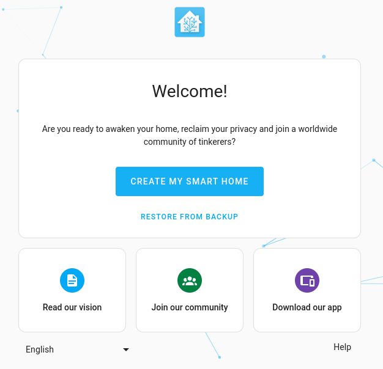

> [!NOTE]
> Thank you to [**@ms1design**](https://github.com/ms1design) for his generous contributions and work on porting Home Assistant & Wyoming containers for Jetson!

<p align="center"></p>

The container image is based on the `Home Assistant Core` with a few modifications:

| | `HA OS` | `Container` | `Core` | [`Core` on `Jetson`](/packages/smart-home/homeassistant-core/) | `Supervised` |
|-|:-:|:-:|:-:|:-:|:-:|
| Automations | ✅ | ✅ | ✅ | ✅ | ✅ |
| Dashboards | ✅ | ✅ | ✅ | ✅ | ✅ |
| Integrations | ✅ | ✅ | ✅ | ✅ | ✅ |
| Blueprints | ✅ | ✅ | ✅ | ✅ | ✅ |
| **Uses container** | ✅ | ✅ | ❌ | ✅[^1] | ✅ |
| Supervisor | ✅ | ❌ | ❌ | ❌ | ✅ |
| **Add-ons** | ✅ | ❌ | ❌ | ✅[^2] | ✅ |
| Backups | ✅ | ✅ | ✅ | ✅ | ✅ |
| Managed Restore | ✅ | ❌ | ❌ |  ❌ | ✅ |
| Managed OS | ✅ | ❌ | ❌ |  ❌ | ❌ |

[^1]: **Home Assistant Core** is now containerized.
[^2]: Supports only manually installed, dockerized and preconfigured [`wyoming` **Local Voice Assistant add-ons**](/packages/smart-home/wyoming/) from this repository. These add-ons are compatible with `Home Assistant Core` hosted on any machine.

## `docker-compose` example

If you want to use `docker compose` to run [Home Assistant Core](/packages/smart-home/homeassistant-core/) [Voice Assistant Pipeline](https://www.home-assistant.io/voice_control/) on a **Jetson** device with `cuda` enabled, you can find a full example [`docker-compose.yaml` here](/packages/smart-home/wyoming/docker-compose.yaml).

```yaml
name: home-assistant-jetson
version: "3.9"
services:
  homeassistant:
    image: dustynv/homeassistant-core:latest-r36.2.0
    restart: unless-stopped
    init: false
    privileged: true
    network_mode: host
    container_name: homeassistant
    hostname: homeassistant
    ports:
      - "8123:8123"
    volumes:
      - ha-config:/config
      - /etc/localtime:/etc/localtime:ro
      - /etc/timezone:/etc/timezone:ro

volumes:
  ha-config:
```

## Onboarding

The user interface can be found at http://your-ip:8123. *(replace with the `hostname` or `IP` of the system)*. Follow the wizard to set up Home Assistant. Feel free to follow the [official instructions](https://www.home-assistant.io/getting-started/onboarding/).

## How to's

We encourage to look for help in the [official Home Assistant documentation](https://www.home-assistant.io/docs/) and within the [HA Community Forums](https://community.home-assistant.io/) or on a [Jetson Research Group](https://www.jetson-ai-lab.com/research.html) [thread on the NVIDIA forum](https://forums.developer.nvidia.com/t/jetson-ai-lab-home-assistant-integration/288225).

<details>
<summary><b>Configuration files location</b></summary>
<hr>

You can specify where you want to store your Home Assistant Core configuration by attaching a docker `volume`. Make sure that you keep the `:/config` part:

```sh
-v /PATH_TO_YOUR_CONFIG:/config
```
<hr>
<br>
</details>

<details>
<summary><b>Devices auto-discovery</b></summary>
<hr>

Home Assistant can discover and automatically configure `zeroconf`/`mDNS` and `UPnP` devices and add-ons on your network. In order for this to work you must create the container with `--net=host`:

when using `docker cli`:
```sh
--net=host
```

when using `docker-compose.yaml`:
```yaml
network_mode: host
```
<hr>
<br>
</details>

<details>
<summary><b>Add-on auto-discovery</b></summary>
<hr>

> **TLDR;** *It's disabled, go with manual way...*

Native auto-discovery of add-ons running on the same host/network is disabled due to the requirement of running [`Home Assistant Supervisor`](https://www.home-assistant.io/integrations/hassio/). This has some deep debian system dependencies which were too tedious to port in this project.

> Most Home Assistant add-ons use [`bashio`](https://github.com/hassio-addons/bashio) under the hood so some of the system overlay commands ware adapted to make them work without `Supervisor`.

#### Manual `wyoming` add-on discovery

To manually add the `wyoming` enabled add-on from this repository to the running Home Assistant Core instance, just follow the steps below:

1. Browse to your **Home Assistant** instance (eg.: `homeassistant.local:8123`).
2. Go to `Settings > Devices & Services`.
3. In the bottom right corner, select the `Add Integration` button.
4. From the list, search & select `Wyoming Protocol`.
5. Enter the `wyoming` add-on `Host IP` address (use `localhost` if running of the same host as Home Assistant).
6. Enter the `wyoming` add-on `port` (default is `10400`).
<hr>
<br>
</details>

<details>
<summary><b>Accessing Bluetooth Devices</b></summary>
<hr>

To provide **Home Assistant** with access to the host's `Bluetooth` device(s), the Home Assistant Core container uses `BlueZ` on the `host` - add the capabilities `NET_ADMIN` and `NET_RAW` to the container, and map `dbus` as a `volume` as shown in the examples below to enable Bluetooth support:

when using `docker cli`:
```sh
--cap-add=NET_ADMIN \
--cap-add=NET_RAW \
-v /var/run/dbus:/var/run/dbus:ro
```
when using `docker-compose.yaml`:
```yaml
cap_add:
  - NET_ADMIN
  - NET_RAW
volumes:
  - /var/run/dbus:/var/run/dbus:ro
```
<hr>
<br>
</details>

## TODO's

- [ ] Fix add-ons auto-discovery

## Support

Got questions? You have several options to get them answered:

#### For general **Home Assistant** Support:
- The [Home Assistant Discord Chat Server](https://discord.gg/c5DvZ4e).
- The Home Assistant [Community Forum](https://community.home-assistant.io/).
- Join the [Reddit subreddit](https://reddit.com/r/homeassistant) in [`/r/homeassistant`](https://reddit.com/r/homeassistant)
- In case you've found an bug in Home Assistant, please [open an issue on our GitHub](https://github.com/home-assistant/addons/issues).

#### For NVIDIA Jetson based Home Assistant Support:
- The NVIDIA Jetson AI Lab [tutorials section](https://www.jetson-ai-lab.com/tutorial-intro.html).
- The Jetson AI Lab - Home Assistant Integration [thread on NVIDIA's Developers Forum](https://forums.developer.nvidia.com/t/jetson-ai-lab-home-assistant-integration/288225).
- In case you've found an bug in `jetson-containers`, please [open an issue on our GitHub](https://github.com/dusty-nv/jetson-containers/issues).

> [!NOTE]
> This project was created by [Jetson AI Lab Research Group](https://www.jetson-ai-lab.com/research.html).
