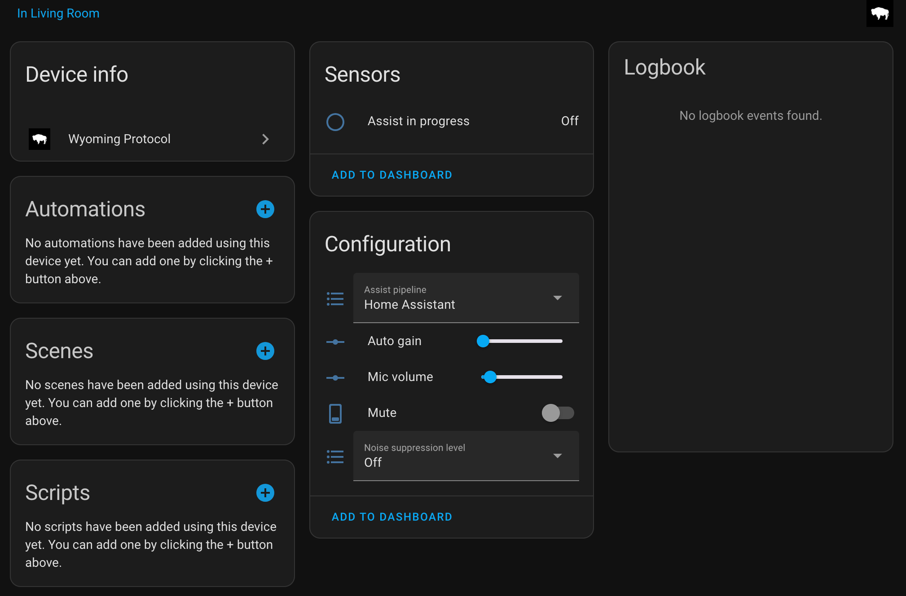

<p align="center"></p>

[`Home Assistant`](https://www.home-assistant.io/) add-on that uses [`wyoming-satellite`](https://github.com/rhasspy/wyoming-satellite) for remote voice [satellite](https://www.home-assistant.io/integrations/wyoming#satellites) using the [`wyoming` protocol](https://www.home-assistant.io/integrations/wyoming/) on **NVIDIA Jetson** devices. Thank you to [**@ms1design**](https://github.com/ms1design) for contributing these Home Assistant & Wyoming containers!

## Features

- [x] Works well with [`home-assistant-core`](/packages/smart-home/homeassistant-core) container on **Jetson devices** as well as Home Assistant hosted on different hosts
- [x] Uses the [`wyoming-openwakeword`](/packages/smart-home/wyoming/openwakeword) container to detect wake words
- [x] Uses the [`wyoming-whisper`](/packages/smart-home/wyoming/wyoming-whisper) container to handle `STT`
- [x] Uses the [`wyoming-piper`](/packages/smart-home/wyoming/piper) container to handle `TTS`

> Requires **Home Assistant** `2023.9` or later.

## `docker-compose` example

If you want to use `docker compose` to run [Home Assistant Core](/packages/smart-home/homeassistant-core/) [Voice Assistant Pipeline](https://www.home-assistant.io/voice_control/) on a **Jetson** device with `cuda` enabled, you can find a full example [`docker-compose.yaml` here](/packages/smart-home/wyoming/docker-compose.yaml).

```yaml
name: home-assistant-jetson
version: "3.9"
services:
  homeassistant:
    image: dustynv/homeassistant-core:latest-r36.2.0
    restart: unless-stopped
    init: false
    privileged: true
    network_mode: host
    container_name: homeassistant
    hostname: homeassistant
    ports:
      - "8123:8123"
    volumes:
      - ha-config:/config
      - /etc/localtime:/etc/localtime:ro
      - /etc/timezone:/etc/timezone:ro

  assist-microphone:
    image: dustynv/wyoming-assist-microphone:latest-r36.2.0
    restart: unless-stopped
    network_mode: host
    container_name: assist-microphone
    hostname: assist-microphone
    runtime: nvidia
    init: false
    ports:
      - "10700:10700/tcp"
    devices:
      - /dev/snd:/dev/snd
      - /dev/bus/usb
    volumes:
      - ha-assist-microphone:/share
      - /etc/localtime:/etc/localtime:ro
      - /etc/timezone:/etc/timezone:ro
    environment:
      SATELLITE_AUDIO_DEVICE: "plughw:CARD=S330,DEV=0"
      SATELLITE_SND_VOLUME_MULTIPLIER: 0.3
      WAKEWORD_NAME: "ok_nabu"
      ASSIST_PIPELINE_NAME: "Home Assistant"

volumes:
  ha-config:
  ha-assist-microphone:
```

## Environment variables

| Variable | Type | Default | Description
| - | - | - | - |
| `SATELLITE_NAME` | `str` | `assist microphone` | Name of the satellite |
| `SATELLITE_AUDIO_DEVICE` | `str` | `plughw:CARD=S330,DEV=0` | Selected Audio Device to use, [read more here](#determine-audio-devices) |
| `SATELLITE_PORT` | `str` | `10700` | Port of the satellite |
| `SATELLITE_SOUND_ENABLED` | `bool` | `true` | Enable or disable connected Speaker |
| `SATELLITE_AWAKE_WAV` | `str` | `/usr/src/sounds/awake.wav` | `WAV` file to play when wake word is detected |
| `SATELLITE_DONE_WAV` | `str` | `/usr/src/sounds/done.wav` | `WAV` file to play when voice command is done |
| `ASSIST_PIPELINE_NAME` | `str` | `Home Assistant` | Home Assistant Voice Assistant Pipeline name to run |
| `WAKEWORD_SERVICE_URI` | `str` | `tcp://127.0.0.1:10400` | `URI` of Wyoming wake word detection service |
| `WAKEWORD_NAME` | `str` | `ok_nabu` | Name of wake word to listen for |
| `SATELLITE_SND_VOLUME_MULTIPLIER` | `float` | `1.0` | Sound volume multiplier |
| `SATELLITE_MIC_VOLUME_MULTIPLIER` | `float` | `1.0` | Mic volume multiplier |
| `SATELLITE_MIC_AUTO_GAIN` | `int` | `0` | Mic auto gain |
| `SATELLITE_MIC_NOISE_SUPPRESSION` | `int` | `0` | Mic noise suppression (`0-4`) |
| `SATELLITE_DEBUG` | `bool` | `true` | Log `DEBUG` messages |

## Configuration

Read more how to configure `wyoming-assist-microphone` in the [official documentation](https://www.home-assistant.io/voice_control/voice_remote_local_assistant#installing-a-local-assist-pipeline).

<p align="center"></p>

### Determine Audio Devices

Picking the correct microphone/speaker devices is critical for the satellite to work.

List your available microphones with:
```bash
arecord -L
```

List your available speakers with:
```bash
aplay -L
```

You should see similar output to below for both commands:
```bash
plughw:CARD=seeed2micvoicec,DEV=0
    seeed-2mic-voicecard, bcm2835-i2s-wm8960-hifi wm8960-hifi-0
    Hardware device with all software conversions
```

Prefer ones that start with `plughw:` or just use `default` if you don't know what to use. It's recommended to choose Microphone and Speaker which has `Hardware device with all software conversions` notation. Set the environment variable `SATELLITE_AUDIO_DEVICE` to:

```bash
plughw:CARD=seeed2micvoicec,DEV=0
```

> `wyoming-assist-microphone` uses the same device for Mic as Speaker.

## TODO's

- [ ] Investigate whether the user should see the transcription of voice commands and responses in the Home Assistant Assist Chat popup when the name of the conversational pipeline is passed as `ASSIST_PIPELINE_NAME`.
- [ ] Split `SATELLITE_AUDIO_DEVICE` into `SATELLITE_MIC_DEVICE` and `SATELLITE_SND_DEVICE` to allow selection of different audio hardware combinations.

## Support

Got questions? You have several options to get them answered:

#### For general **Home Assistant** Support:
- The [Home Assistant Discord Chat Server](https://discord.gg/c5DvZ4e).
- The Home Assistant [Community Forum](https://community.home-assistant.io/).
- Join the [Reddit subreddit](https://reddit.com/r/homeassistant) in [`/r/homeassistant`](https://reddit.com/r/homeassistant)
- In case you've found an bug in Home Assistant, please [open an issue on our GitHub](https://github.com/home-assistant/addons/issues).

#### For NVIDIA Jetson based Home Assistant Support:
- The NVIDIA Jetson AI Lab [tutorials section](https://www.jetson-ai-lab.com/tutorial-intro.html).
- The Jetson AI Lab - Home Assistant Integration [thread on NVIDIA's Developers Forum](https://forums.developer.nvidia.com/t/jetson-ai-lab-home-assistant-integration/288225).
- In case you've found an bug in `jetson-containers`, please [open an issue on our GitHub](https://github.com/dusty-nv/jetson-containers/issues).

> [!NOTE]
> This project was created by [Jetson AI Lab Research Group](https://www.jetson-ai-lab.com/research.html).
