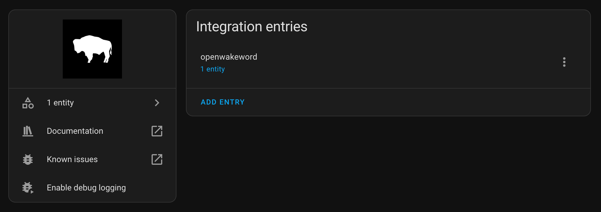
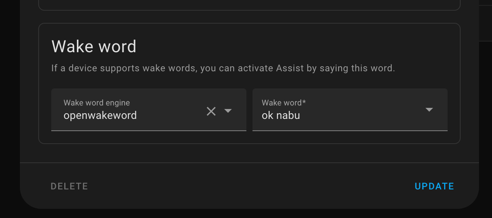

<p align="center"></p>

[`Home Assistant`](https://www.home-assistant.io/) add-on that uses [`openWakeWord`](https://github.com/rhasspy/wyoming-openwakeword) ([demo on huggingface](https://huggingface.co/spaces/davidscripka/openWakeWord)) for wake word detection over the [`wyoming` protocol](https://www.home-assistant.io/integrations/wyoming/) on **NVIDIA Jetson** devices. Thank you to [**@ms1design**](https://github.com/ms1design) for contributing these Home Assistant & Wyoming containers!

## Features

- [x] Works well with [`home-assistant-core`](/packages/smart-home/homeassistant-core) container on **Jetson devices** as well as Home Assistant hosted on different hosts
- [x] Use [custom wake word's](#training-custom-wake-words), pass model name as `OPENWAKEWORD_PRELOAD_MODEL` to preload custom model. For example you can find `jetson` (*`jets_un`*) wake word model included in `/share/openwakeword` models directory.
- [x] Supports `*.tflite` `CPU` wake word models
- [ ] Supports `*.onnx` `CUDA` wake word models [WIP]

> Requires **Home Assistant** `2023.9` or later.

## `docker-compose` example

If you want to use `docker compose` to run [Home Assistant Core](/packages/smart-home/homeassistant-core/) [Voice Assistant Pipeline](https://www.home-assistant.io/voice_control/) on a **Jetson** device with `cuda` enabled, you can find a full example [`docker-compose.yaml` here](/packages/smart-home/wyoming/docker-compose.yaml).

```yaml
name: home-assistant-jetson
version: "3.9"
services:
  homeassistant:
    image: dustynv/homeassistant-core:latest-r36.2.0
    restart: unless-stopped
    init: false
    privileged: true
    network_mode: host
    container_name: homeassistant
    hostname: homeassistant
    ports:
      - "8123:8123"
    volumes:
      - ha-config:/config
      - /etc/localtime:/etc/localtime:ro
      - /etc/timezone:/etc/timezone:ro

  openwakeword:
    image: dustynv/wyoming-openwakeword:latest-r36.2.0
    restart: unless-stopped
    runtime: nvidia
    network_mode: host
    container_name: openwakeword
    hostname: openwakeword
    init: false
    ports:
      - "10400:10400/tcp"
    volumes:
      - ha-openwakeword-custom-models:/share/openwakeword
      - /etc/localtime:/etc/localtime:ro
      - /etc/timezone:/etc/timezone:ro
    environment:
      OPENWAKEWORD_CUSTOM_MODEL_DIR: /share/openwakeword
      OPENWAKEWORD_PRELOAD_MODEL: ok_nabu

volumes:
  ha-config:
  ha-openwakeword-custom-models:
```

## Environment variables

| Variable | Type | Default | Description
| - | - | - | - |
| `OPENWAKEWORD_PORT` | `str` | `10400` | Port number to use on `host` |
| `OPENWAKEWORD_THRESHOLD` | `float` | `0.5` | Wake word model threshold (`0.0`-`1.0`), where higher means fewer activations. |
| `OPENWAKEWORD_TRIGGER_LEVEL` | `int` | `1` | Number of activations before a detection is registered. A higher trigger level means fewer detections. |
| `OPENWAKEWORD_PRELOAD_MODEL`| `str` | `ok_nabu` | Name or path of wake word model to pre-load. The name of the model should match with name used during [custom wake word model training](#training-custom-wake-words). When changing this, it's also recommended to set `WAKEWORD_NAME` variable with same value for [`wyoming-assist-microphone`](/packages/smart-home/wyoming/assist-microphone) container |
| `OPENWAKEWORD_CUSTOM_MODEL_DIR` | `str` | `/share/openwakeword` | Path to directory containing custom wake word models. *Skip the trailing slash (`/`)* |
| `OPENWAKEWORD_DEBUG` | `bool` | `true` | Log `DEBUG` messages |

## Configuration

Read more how to configure `wyoming-openwakeword` in the [official documentation](https://www.home-assistant.io/voice_control/install_wake_word_add_on#enabling-wake-word-for-your-voice-assistant):

<p align="center"></p>

## Training custom wake word's

> [!NOTE]
> You can find a custom trained, example `jetson` (`jets_un`) wake word model in the custom models directory (`/share/openwakeword`). To use it, set `WAKEWORD_NAME` to `jets_un` in appropriate containers.

The Home Assistant Community has [trained numerous wake word models](https://github.com/fwartner/home-assistant-wakewords-collection), as detailed in this GitHub repository. However, these models are specifically designed for use with `CPU`.

To train a new wake word model for `CPU` (`*.tflite`) or `cuda` (`*.onnx`), you can follow [@dscripka](https://github.com/dscripka) [documentation](https://github.com/dscripka/openWakeWord?tab=readme-ov-file#training-new-models) or just jump to the point and use [wake word training environment](https://colab.research.google.com/drive/1q1oe2zOyZp7UsB3jJiQ1IFn8z5YfjwEb).

## TODO's

- [ ] Build `openWakeWord` from source based on `onnxruntime` `gpu` enabled container (currently `openWakeWord` is still using `tflite` models instead `onnx`)
- [ ] Custom Wake Word Models training container using automatic synthetic data creation

## Support

Got questions? You have several options to get them answered:

#### For general **Home Assistant** Support:
- The [Home Assistant Discord Chat Server](https://discord.gg/c5DvZ4e).
- The Home Assistant [Community Forum](https://community.home-assistant.io/).
- Join the [Reddit subreddit](https://reddit.com/r/homeassistant) in [`/r/homeassistant`](https://reddit.com/r/homeassistant)
- In case you've found an bug in Home Assistant, please [open an issue on our GitHub](https://github.com/home-assistant/addons/issues).

#### For NVIDIA Jetson based Home Assistant Support:
- The NVIDIA Jetson AI Lab [tutorials section](https://www.jetson-ai-lab.com/tutorial-intro.html).
- The Jetson AI Lab - Home Assistant Integration [thread on NVIDIA's Developers Forum](https://forums.developer.nvidia.com/t/jetson-ai-lab-home-assistant-integration/288225).
- In case you've found an bug in `jetson-containers`, please [open an issue on our GitHub](https://github.com/dusty-nv/jetson-containers/issues).

> [!NOTE]
> This project was created by [Jetson AI Lab Research Group](https://www.jetson-ai-lab.com/research.html).