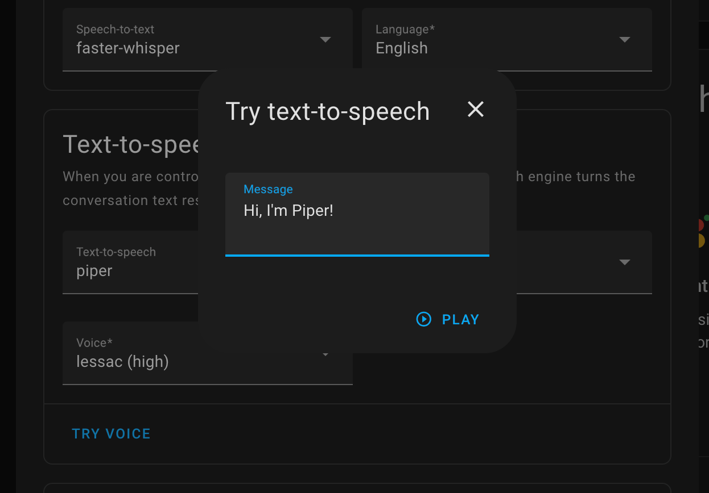

<p align="center"></p>

[`Home Assistant`](https://www.home-assistant.io/) add-on that uses [`wyoming-piper`](https://github.com/rhasspy/wyoming-piper) for text to speech system using the [`wyoming` protocol](https://www.home-assistant.io/integrations/wyoming/) on **NVIDIA Jetson** devices.

### Features

- [x] Works well with [`home-assistant-core`](packages/smart-home/homeassistant-core) container on **Jetson devices** as well as `Home Assistant` hosted on different host's
- [x] `GPU` Accelerated on **Jetson Devices** thank's to [`piper-tts` container](packages/audio/piper-tts)

> Requires **Home Assistant** `2023.9` or later.

<details open>
<summary><h3 style="display:inline"><code>docker-compose</code> example</h3></summary>
<br>

```yaml
name: home-assistant-jetson
version: "3.9"
services:
  homeassistant:
    image: dusty-nv/homeassistant-core:latest-r36.2.0-cu122-cp310
    restart: unless-stopped
    init: false
    privileged: true
    network_mode: host
    container_name: homeassistant
    hostname: homeassistant
    ports:
      - "8123:8123"
    volumes:
      - ha-config:/config
      - /etc/localtime:/etc/localtime:ro
      - /etc/timezone:/etc/timezone:ro
    stdin_open: true
    tty: true

  piper-tts:
    image: ms1design/wyoming-piper:master-r36.2.0-cu122-cp311
    restart: unless-stopped
    network_mode: host
    container_name: piper-tts
    hostname: piper-tts
    runtime: nvidia
    init: false
    ports:
      - "10200:10200/tcp"
    devices:
      - /dev/snd:/dev/snd
      - /dev/bus/usb
    volumes:
      - ha-piper-tts-models:/data/models/piper
      - /etc/localtime:/etc/localtime:ro
      - /etc/timezone:/etc/timezone:ro
    environment:
      TZ: ${ENV_TZ}
    stdin_open: true
    tty: true

volumes:
  ha-config:
  ha-piper-tts-models:
```
</details>

### Environment variables

| Variable | Type | Default | Description
| - | - | - | - |
| `PIPER_PORT` | `str` | `10200` | Port number to use on `host` |
| `PIPER_CACHE` | `str` | `/data/models/piper` | Name of a default mounted location available for downloading the models |
| `PIPER_UPDATE_VOICES` | `bool` | `true` | Download latest `voices.json` during startup |
| `PIPER_LENGTH_SCALE` | `float` | `1.0` | Phoneme length |
| `PIPER_NOISE_SCALE` | `float` | `0.667` | Generator noise |
| `PIPER_NOISE_W` | `float` | `0.333` | Phoneme width noise |
| `PIPER_SPEAKER` | `[str, int]` | `0` | Name or id of speaker for default voice |
| `PIPER_VOICE` | `str` | `en_US-lessac-high` | Default Piper voice to use (e.g., `en_US-lessac-medium`) from [list of available voices](https://github.com/rhasspy/piper?tab=readme-ov-file#voices)
| `PIPER_MAX_PROC` | `int` | `1` | Maximum number of piper process to run simultaneously |
| `PIPER_DEBUG` | `bool` | `true` | Log `DEBUG` messages |

## Configuration

Read more how to configure `wyoming-piper` in the [official documentation](https://www.home-assistant.io/voice_control/voice_remote_local_assistant#installing-a-local-assist-pipeline):

<p align="center"></p>

### Available Voices

List of available voices to download is [available here](https://github.com/rhasspy/piper?tab=readme-ov-file#voices).

## TODO's

- [ ] Testing

## Support

Got questions? You have several options to get them answered:

#### For general **Home Assistant** Support:
- The [Home Assistant Discord Chat Server](https://discord.gg/c5DvZ4e).
- The Home Assistant [Community Forum](https://community.home-assistant.io/).
- Join the [Reddit subreddit](https://reddit.com/r/homeassistant) in [`/r/homeassistant`](https://reddit.com/r/homeassistant)
- In case you've found an bug in Home Assistant, please [open an issue on our GitHub](https://github.com/home-assistant/addons/issues).

#### For NVIDIA Jetson based Home Assistant Support:
- The NVIDIA Jetson AI Lab [tutorials section](https://www.jetson-ai-lab.com/tutorial-intro.html).
- The Jetson AI Lab - Home Assistant Integration [thread on NVIDIA's Developers Forum](https://forums.developer.nvidia.com/t/jetson-ai-lab-home-assistant-integration/288225).
- In case you've found an bug in `jetson-containers`, please [open an issue on our GitHub](https://github.com/dusty-nv/jetson-containers/issues).
